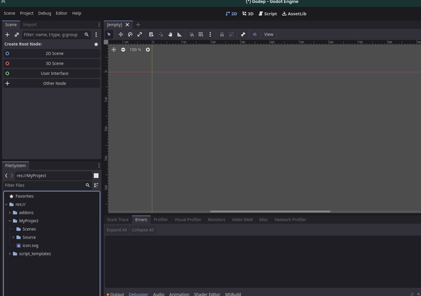
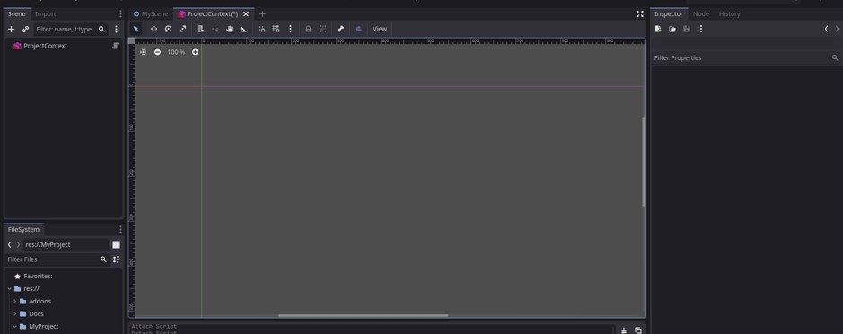
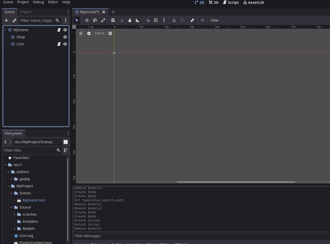
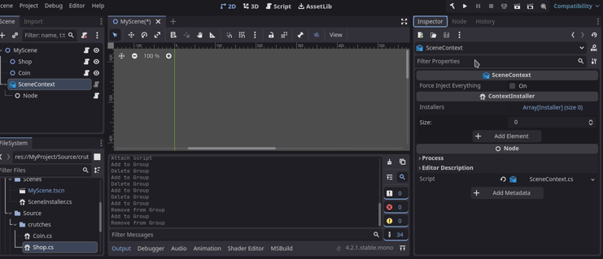

# :wrench: Base setup
## ProjectContext
ProjectContext declares dependencies that should be accessible from anywhere in the game. They are not lost when new scenes are loaded. For example, global game configs, or authentication data can be placed here.

### Setup

1) Copy the ProjectContext.tscn object prefab from addons/godep/prefabs to a convenient location

2) Add the copied object to AutoLoad (as shown in the video)

3) Go to ProjectContext.tscn, add a child node and bind a new script to it that inherits from the Installer class. For simplicity you should use script_templates/Installer/CustomInstaller.cs template. 
Don't forget to trigger the build after adding new scripts to csharp

4) Add this installer to the ProjectContext installer list.

5) Configure the installer to install the dependencies you need (See Binding and injection(WIP)). This assumes application-level dependencies (configs, authentication data, etc.)

## SceneContext
SceneContext declares dependencies at the scene level. Once the scene is unloaded, these dependencies are lost from view.
Even if your scene doesn't bind new dependencies, SceneContext is still needed. It searches for injection candidates and then provides them with the necessary dependencies from its container (scene dependencies) and from the ProjectContext (application dependencies).

### Setup

1) Create a SceneContext object using a custom type from the node list.
    Place the SceneContext at the very end of the hierarchy! Only scene installers and objects that don't need dependency injection can be below.
    This is because the SceneContext._EnterTree() method should be called last, when all nodes have already been added to the scene and their fields can already be parsed.

    

2) Set up the SceneContext and its installers the same way you did with ProjectContext. Installers should be set in the corresponding "Installers" field of the SceneContext.

3) There are two ways to inject dependencies: through **RequiresInject** group, or without it.
    - The option without group assignment is easy to configure: just check the forceInjectEverything field in SceneContext. However, in this case all objects of this scene will be parsed at the moment of loading.
    - If there are a lot of objects in the scene that don't need dependency enforcement, you can try using the RequiresInject group for better performance. To do this, create it, and then add to it all objects that require dependency injection (that use the Inject attribute). This way SceneContext will know which objects to consider. An example is shown in the animation.
    
    

## Congrats!
Customization in the editor is complete, I recommend reading the sections:
- Binding and injection(WIP), for understanding how and when to use it
- Warnings(WIP), to understand the plugin's current limitations and issues to avoid