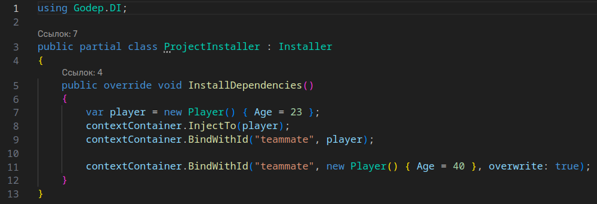

# Godep: Godot C# dependency injection plugin
Make DI easy again. Inspired by [Zenject](https://github.com/modesttree/Zenject).  
:warning:  This plugin is in active development state. 

## :zap: Features
- Project/Scene context separation
- Injecting with attribute `[Inject]`
- Inject by ID option
- Nested containers
- Works with pure C# classes
- Custom types, code template for faster setup

## :warning: TODO
- GDScript support
- Constructor injection
- Lazy loading
- Parallel processing

## Documentation
- [Base Setup](Docs/BaseSetup.md)
- Binding and injection(WIP)
- Warnings(WIP)

# Screenshots

 

 
